# FOCUS – Student Productivity & AI Study Assistant

### 🔗 Live Website  
https://coxx6j-my-site-1vp0llef-jagadish3506.wix-vibe.com/

FOCUS is a productivity and AI-powered study assistant designed to help students stay consistent, organized, and focused.  
The platform includes a focus timer, daily planner, AI tools, dashboard statistics, profile system, and a clean, responsive UI.

---

## 🚀 Features

### ⏳ Focus Timer  
- 25-minute default focus sessions  
- Custom session durations  
- Session progress screen  
- Start / Pause / Reset  

### 📝 Planner  
- Add, edit, delete tasks  
- Calendar task assignment  
- Clean UI for daily planning  

### 🤖 AI Help Tools  
- Ask questions  
- Get explanations  
- Study support  

### 📊 Dashboard  
- Daily stats  
- Timer history  
- Simple navigation  

### 👤 Profile  
- Basic profile section  
- Clean interface  

---
## 📸 Screenshots

### 🏠 Home / Dashboard
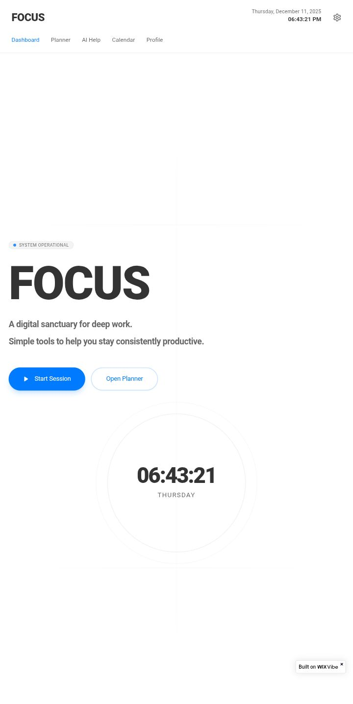
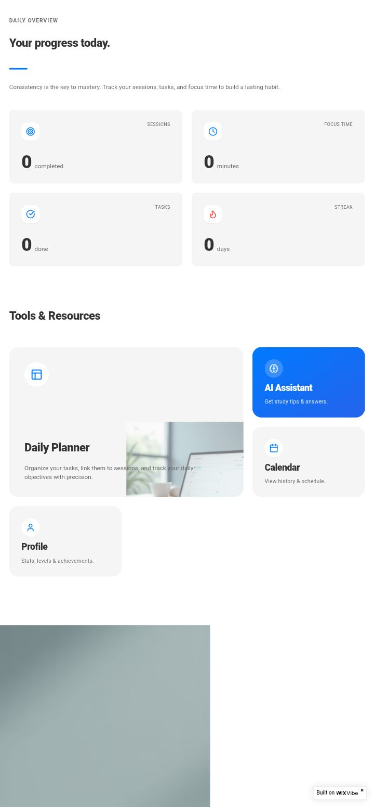
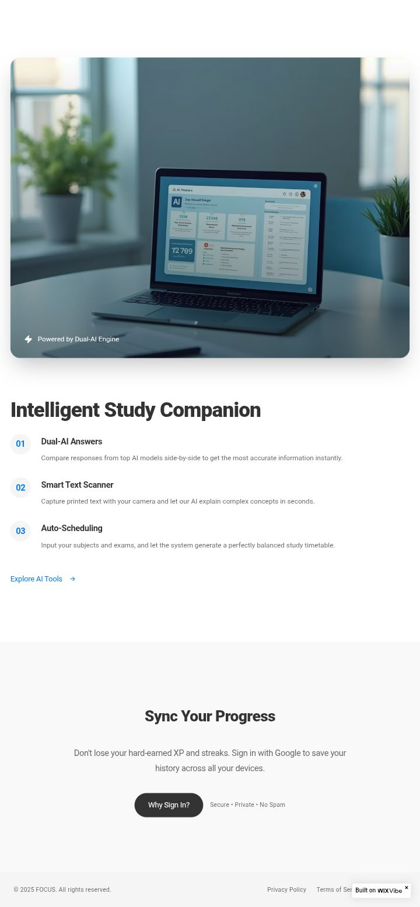

---

### 📝 Planner
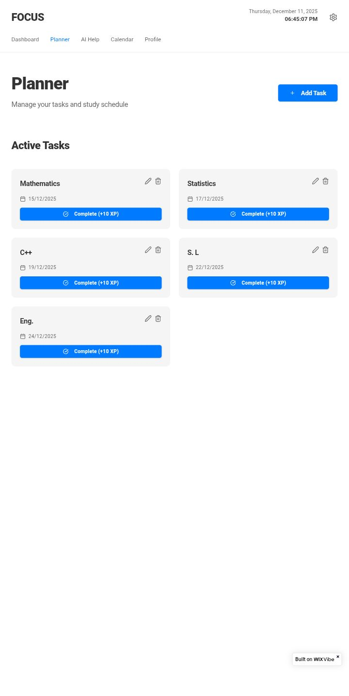

---

### 🤖 AI Tools

#### AI Answer Assistant
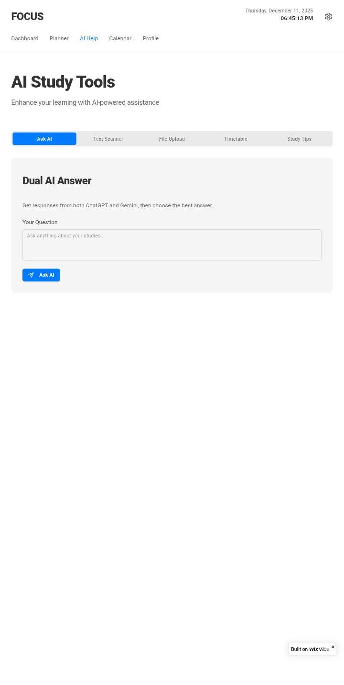

#### AI Text Scanner
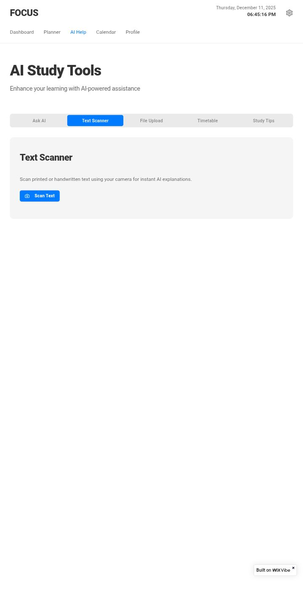

#### AI File Summariser
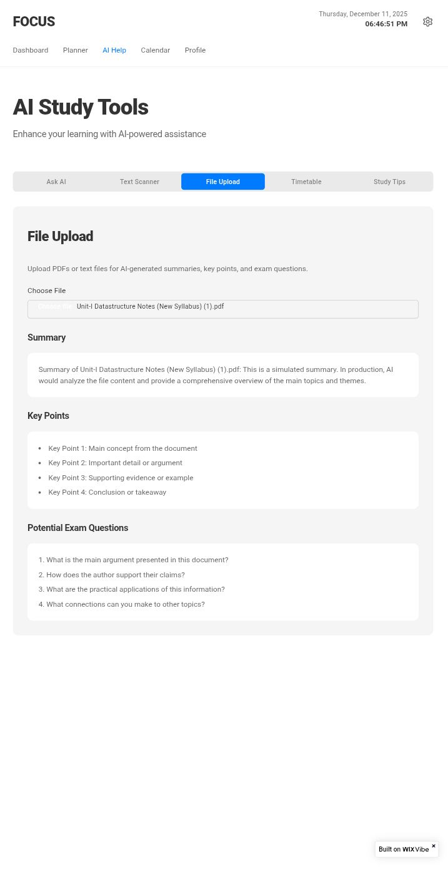

#### AI Timetable Generator
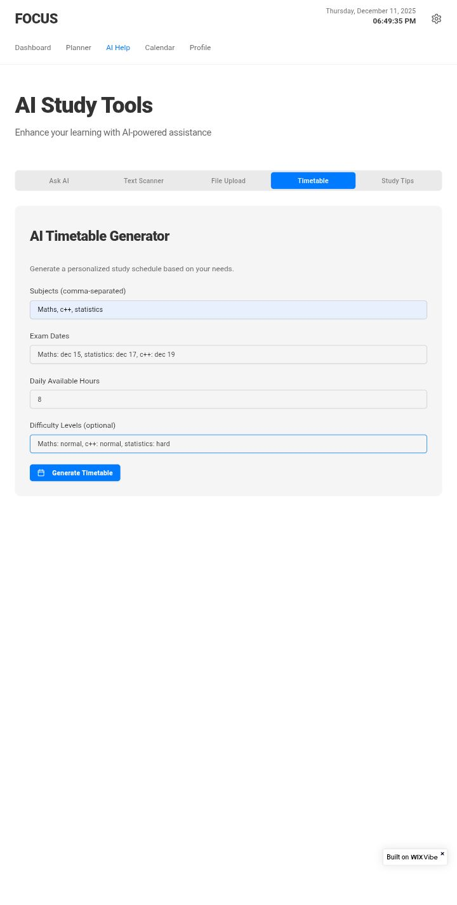
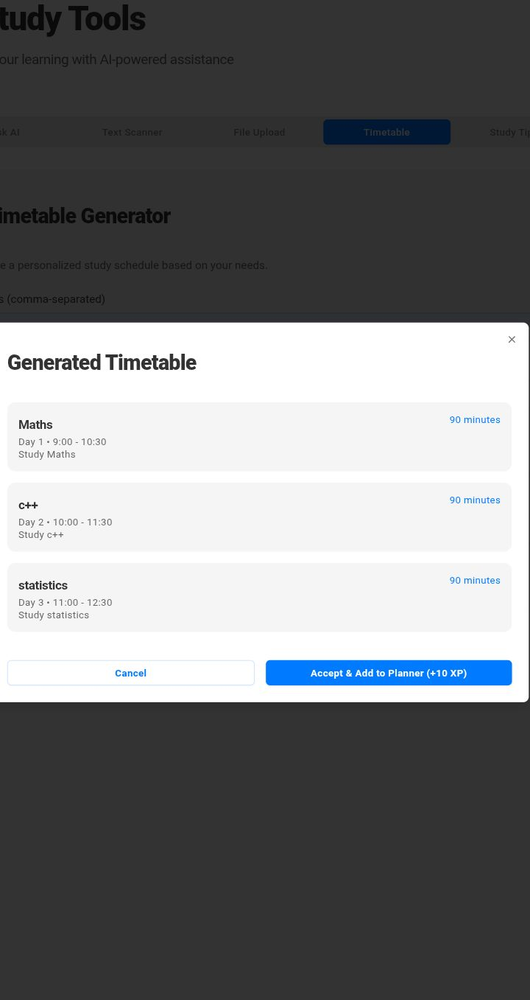

#### AI Study Tips
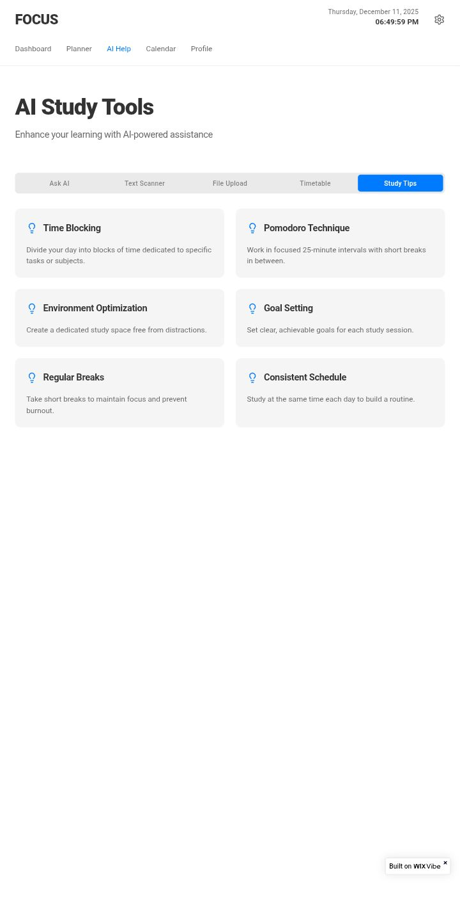

---

### 📅 Time Table Tasks
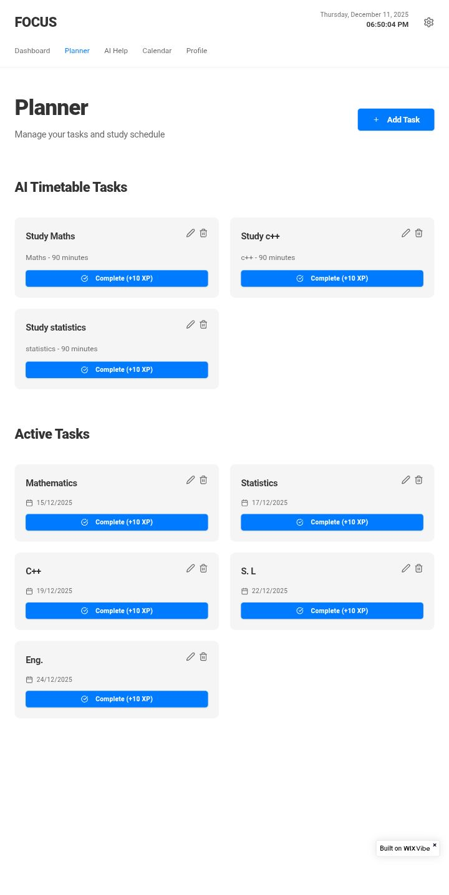

---

### 👤 Profile Page
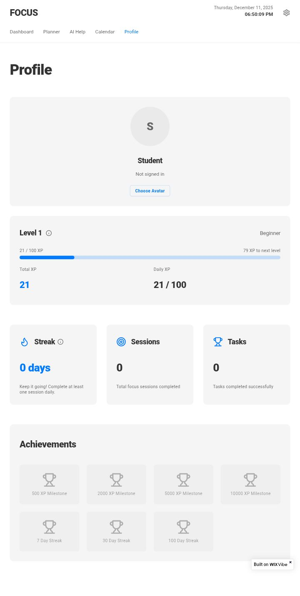

---

## 👥 Team Members
- S. Prabhas  
- B. Tarun Kumar  
- D. Vamshi  
- N. Jagadish  
- P. Shashank  
- T. Lokesh  

---

## 📌 Project Info
This project was created as part of an academic assignment to demonstrate UI/UX design with a prototype website.
